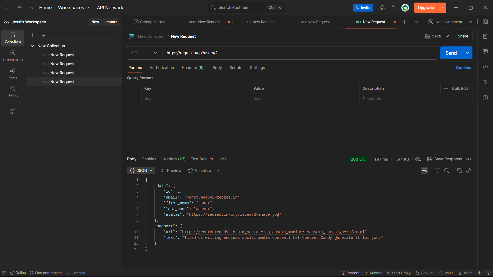
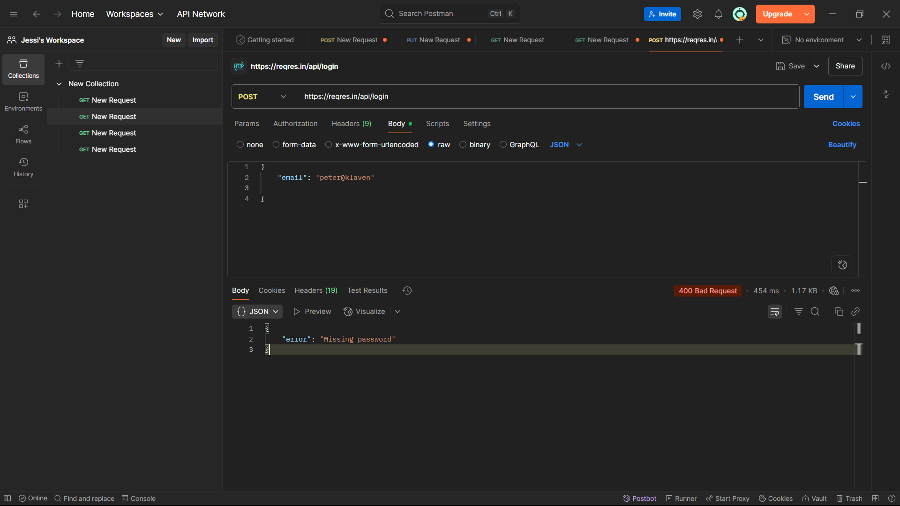
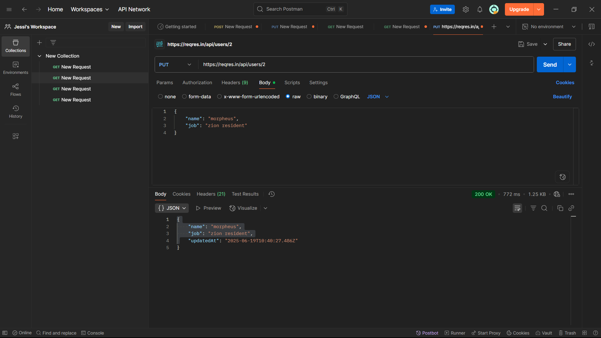
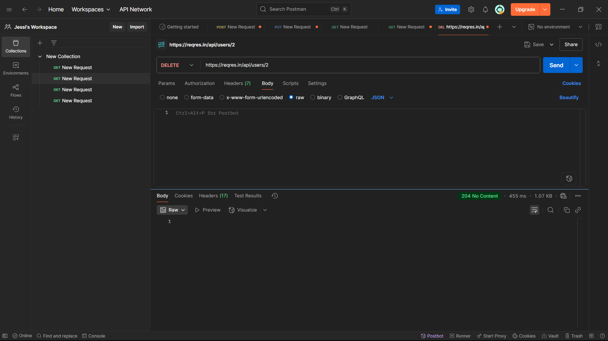

# 🚀 Postman Practice

## 📌 Giới thiệu

**Postman** là một công cụ mạnh mẽ giúp lập trình viên và tester dễ dàng gửi các yêu cầu HTTP (GET, POST, PUT, DELETE...) đến API, kiểm tra phản hồi (response) và tự động hóa kiểm thử. Postman hỗ trợ:

- Giao diện đồ họa thân thiện
- Tạo collection chứa nhiều API
- Sử dụng biến môi trường (`{{base_url}}`, `{{token}}`)
- Viết test kiểm tra phản hồi tự động (test scripts)
- Chia sẻ & lưu trữ qua Postman cloud

---

## 📝 Mô tả bài thực hành

Bài thực hành sử dụng công cụ Postman để kiểm thử các phương thức HTTP cơ bản thông qua API mẫu từ `https://reqres.in`.

---

## ✅ Nội dung đã thực hiện

- Gửi request `GET`, `POST`, `PUT`, `DELETE` tới API mẫu
- Tạo **Collection** trong Postman
- Viết test case đơn giản với `pm.test()`
- Sử dụng **Environment Variables** trong Postman
- Kiểm thử API có xác thực `Bearer Token`

---

## 📸 Hình ảnh minh họa

### 1️⃣ Test case `GET` – Lấy danh sách người dùng

**🔍 Mô tả:** Kiểm thử API lấy danh sách người dùng với phân trang

**📋 Chi tiết:**
- **Phương thức:** `GET`
- **Base URL:** `https://reqres.in/api/users?page=2`
- **Headers:** `Content-Type: application/json`
- **Mục đích:** Lấy danh sách người dùng ở trang thứ 2
- **Kết quả mong đợi:** Status `200 OK` với danh sách users

```http
GET https://reqres.in/api/users?page=2
```

**✅ Test Scripts:**
```javascript
pm.test("Status code is 200", function () {
    pm.response.to.have.status(200);
});

pm.test("Response has data array", function () {
    var jsonData = pm.response.json();
    pm.expect(jsonData.data).to.be.an('array');
});
```

<div align="center">

</div>

---

### 2️⃣ Test case `POST` – Đăng nhập thiếu thông tin

**🔍 Mô tả:** Kiểm thử trường hợp đăng nhập khi thiếu password (negative test)

**📋 Chi tiết:**
- **Phương thức:** `POST`
- **Base URL:** `https://reqres.in/api/login`
- **Headers:** `Content-Type: application/json`
- **Mục đích:** Kiểm tra validation khi thiếu trường bắt buộc
- **Kết quả mong đợi:** Status `400 Bad Request` với thông báo lỗi

**Body gửi đi:**
```json
{
  "email": "peter@klaven"
}
```

**Kết quả mong đợi:**
```json
{
  "error": "Missing password"
}
```

**✅ Test Scripts:**
```javascript
pm.test("Status code is 400", function () {
    pm.response.to.have.status(400);
});

pm.test("Error message for missing password", function () {
    var jsonData = pm.response.json();
    pm.expect(jsonData.error).to.eql("Missing password");
});
```

<div align="center">

</div>

---

### 3️⃣ Test case `PUT` – Cập nhật thông tin người dùng

**🔍 Mô tả:** Kiểm thử API cập nhật thông tin người dùng theo ID

**📋 Chi tiết:**
- **Phương thức:** `PUT`
- **Base URL:** `https://reqres.in/api/users/2`
- **Headers:** `Content-Type: application/json`
- **Mục đích:** Cập nhật thông tin name và job của user ID = 2
- **Kết quả mong đợi:** Status `200 OK` với thông tin đã cập nhật

**Body gửi đi:**
```json
{
  "name": "Baonguyen",
  "job": "Tester"
}
```

**✅ Test Scripts:**
```javascript
pm.test("Status code is 200", function () {
    pm.response.to.have.status(200);
});

pm.test("Response contains updated data", function () {
    var jsonData = pm.response.json();
    pm.expect(jsonData.name).to.eql("Baonguyen");
    pm.expect(jsonData.job).to.eql("Tester");
});

pm.test("Response has updatedAt field", function () {
    var jsonData = pm.response.json();
    pm.expect(jsonData.updatedAt).to.exist;
});
```

<div align="center">

</div>

---

### 4️⃣ Test case `DELETE` – Xóa người dùng

**🔍 Mô tả:** Kiểm thử API xóa người dùng theo ID

**📋 Chi tiết:**
- **Phương thức:** `DELETE`
- **Base URL:** `https://reqres.in/api/users/2`
- **Headers:** `Content-Type: application/json`
- **Mục đích:** Xóa user có ID = 2 khỏi hệ thống
- **Kết quả mong đợi:** Status `204 No Content` (xóa thành công, không có body response)

**✅ Test Scripts:**
```javascript
pm.test("Status code is 204", function () {
    pm.response.to.have.status(204);
});

pm.test("Response body is empty", function () {
    pm.expect(pm.response.text()).to.be.empty;
});

pm.test("Response time is less than 2000ms", function () {
    pm.expect(pm.response.responseTime).to.be.below(2000);
});
```

<div align="center">

</div>

---

## 🎯 Kết quả & học được gì?

- Hiểu rõ cách hoạt động của các HTTP methods: `GET`, `POST`, `PUT`, `DELETE`
- Biết cách kiểm thử nhanh các API với Postman
- Viết được test case đơn giản để kiểm tra response
- Làm quen với biến môi trường trong Postman (`{{token}}`, `{{base_url}}`)
- Sử dụng API công khai (public API) như `reqres.in` để luyện tập mà không cần backend riêng

---

## 📚 Tài liệu tham khảo

- [Postman Official Website](https://www.postman.com/)
- [Postman Learning Center](https://learning.postman.com/)
- [ReqRes - Test API](https://reqres.in/)